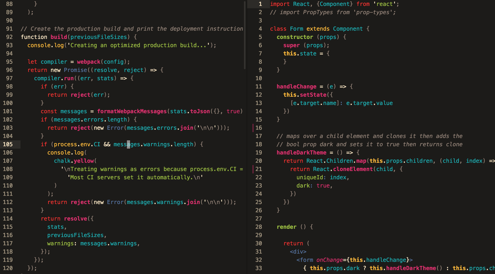

       ,-,--.               _,.----.       ,----.                             .=-.-.
     ,-.'-  _\ .-.,.---.  .' .' -   \   ,-.--` , \  .-.,.---.  ,--.-.  .-,--./==/_ /
    /==/_ ,_.'/==/  `   \/==/  ,  ,-'  |==|-  _.-` /==/  `   \/==/- / /=/_ /|==|, |  
    \==\  \  |==|-, .=., |==|-   |  .  |==|   `.-.|==|-, .=., \==\, \/=/. / |==|  |  
     \==\ -\ |==|   '='  /==|_   `-' \/==/_ ,    /|==|   '='  /\==\  \/ -/  /==/. /  
     _\==\ ,\|==|- ,   .'|==|   _  , ||==|    .-' |==|- ,   .'  |==|  ,_/   `--`-`   
    /==/\/ _ |==|_  . ,'.\==\.       /|==|_  ,`-._|==|_  . ,'.  \==\-, /     .=.     
    \==\ - , /==/  /\ ,  )`-.`.___.-' /==/ ,     //==/  /\ ,  ) /==/._/     :=; :    
     `--`---'`--`-`--`--'             `--`-----`` `--`-`--`--'  `--`-`       `=`          
                  _,._      
      .||,       /_ _\\     
     \.`',/      |'L'| |    
     = ,. =      | -,| L    
     / || \    ,-'\"/,'`.   
       ||     ,'   `,,. `.  
       ,|____,' , ,;' \| |  
      (3|\    _/|/'   _| |  
       ||/,-''  | >-'' _,\\
       ||'      ==\ ,-'  ,'
       ||       |  V \ ,|   
       ||       |    |` |   
       ||       |    |   \  
       ||       |    \    \
       ||       |     |    \
       ||       |      \_,-'
       ||       |___,,--")_\
       ||         |_|   ccc/
       ||        ccc/       
       ||                

###A thoughtful port of Roosta's [vim-srcery](https://github.com/roosta/vim-srcery) for Atom! Best used with twenty-sided dice on your bedroom floor surrounded by snacks and graph paper.

Looks great with ES6, JSX, and Styled-components.

